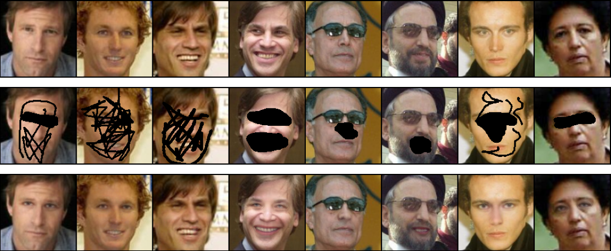

# CICR-Impainting

## Présentation

Ce repo à été crée en juin 2022 à l'occasion d'un stage en partenariat entre l'INSA et le CICR. L'objectif était de produire un modèle capable de reconstruire un visage abimé. 

 </br>

## Installation 

### Installation des libraries

Utiliser la commande **pip install -r ./requirements.txt** 

### Téléchargement des datasets 

- Lancer un inviter de commande et éxecuter [./dataset.sh](dataset.sh) téléchargera tous les datasets que nous avons utilisés
- Attention à avoir assez de place sur la machine
- Si tous ces dossiers ne sont pas dans data alors leur .zip doit se trouver dans le repertoire racine et peuvent être extrait manuellement
- Attention à donner le même nom que ceux suivants pour que la librairie les retrouve bien : </br>
**data/ </br>
├─ utk/</br>
├─ test/</br>
├─ masks/</br>
├─ flickr/</br>
├─ lfw/</br>
├─ celeba/**

En cas d'erreur liens de téléchargement : 
- [Celeba](https://drive.google.com/file/d/0B7EVK8r0v71pZjFTYXZWM3FlRnM/view?usp=sharing&resourcekey=0-dYn9z10tMJOBAkviAcfdyQ)
- [Flickr](https://drive.google.com/drive/folders/1tg-Ur7d4vk1T8Bn0pPpUSQPxlPGBlGfv) 
- [Lfw](http://vis-www.cs.umass.edu/lfw/lfw.tgz) 
- [Utk](https://drive.google.com/drive/folders/0BxYys69jI14kU0I1YUQyY1ZDRUE?resourcekey=0-01Pth1hq20K4kuGVkp3oBw) 
- [Nvidia mask test](https://www.dropbox.com/s/01dfayns9s0kevy/test_mask.zip) 
- [Nvidia mask training](https://www.dropbox.com/s/qp8cxqttta4zi70/irregular_mask.zip) (non utilisé) 


## Application

### Lancement

Une docker image à été mis en place pour préparer le re-déploiement de l'application web sur un autre serveur.
L'image se situe ici [cicr-docker.tar](cicr-docker.tar) et peut être utilisé avec les commandes suivantes (si docker est bien installé).
```
sudo docker load < cicr-docker.tar 
sudo docker run -d --network="host" cicr-docker
```
Il y aura cependant un petit délai entre la commande de run et l'accès au site lié au téléchargement des modèles pré-entrainés.
Si l'image ne convient pas il est possible de la re-générer grâce au [Dockerfile](Dockerfile).

### Utilisation 

 </br>

Plusieurs options ne sont pas présenté dans le gif ci-dessus: 
- **Image's resizing** : Faire glisser le curseur vers la gauche fera "dézoomer" et inversement en allant à droite.  Il faudra appuyer sur le bouton à côté après modification du curseur. Un resizing entraine la perte de la segmentation et des keypoints courants.
- **Autres curseurs** : Ils servent à modifier la taille de la brosse lors du dessin.
- **Boutons gris dans l'onglet segmentation** : Ils permettent de changer le type de brosse en fonction d'un type de zone du visage.
- **Enhance** : Utilisera un modèle ESRGAN sur le résultat pour améliorer la résolution (ne marche pas très bien sur les zones reconstruites.

Une version de test est disponible à l'adresse : https://heinekayn.me</br>
Mises en garde quant à l'application web : 
- Il peut y avoir quelques bugs (il faut parfois refresh la page ou rappuyer une autre fois sur un bouton)  
- Le serveur peut être arrêté de temps en temps pour des updates ou à cause d'un bug (il y'aura alors une erreur 502 bad gateway)  
- Si plusieurs personnes utilisent le site en même temps il peut y avoir des conflicts
- Le serveur stock la dernière image impainté (et seulement elle). En modifier une suivante écrasera celle précedemment stocké.

## Présentation de la librairie

- Un tutoriel est disponible dans le notebook [tutorial.ipynb](tutorial.ipynb)
- La documentation est disponible [ici](documentation/) ou en utilisant **pdoc .\impaintingLib** après avoir **pip install pdoc**

### Historique des pistes envisagés

Disponible [ici](historique.md)

### Références
```
ESRGAN : 
@InProceedings{wang2018esrgan,
    author = {Wang, Xintao and Yu, Ke and Wu, Shixiang and Gu, Jinjin and Liu, Yihao and Dong, Chao and Qiao, Yu and Loy, Chen Change},
    title = {ESRGAN: Enhanced super-resolution generative adversarial networks},
    booktitle = {The European Conference on Computer Vision Workshops (ECCVW)},
    month = {September},
    year = {2018}
}

Segmentation
@inproceedings{CelebAMask-HQ,
  title={MaskGAN: Towards Diverse and Interactive Facial Image Manipulation},
  author={Lee, Cheng-Han and Liu, Ziwei and Wu, Lingyun and Luo, Ping},
  booktitle={IEEE Conference on Computer Vision and Pattern Recognition (CVPR)},
  year={2020}
}
```
